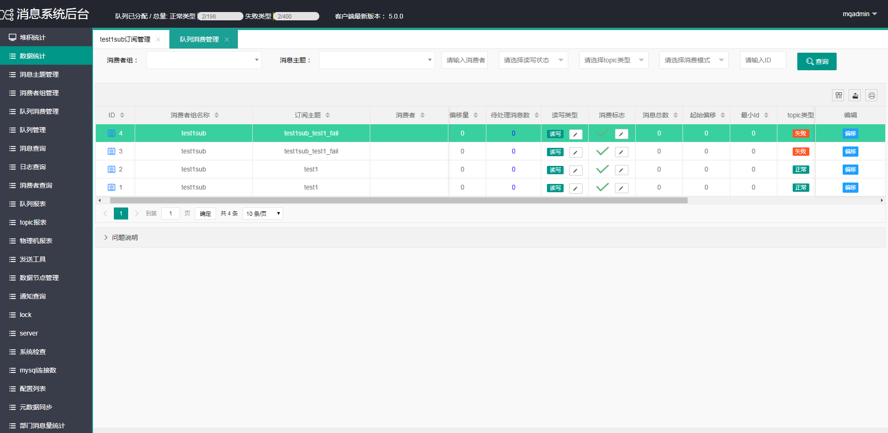

# PMQ 拍拍贷微服务`消息队列`介绍

PMQ是拍拍贷自研的一款轻量级分布式消息队列，能够保证消息的不丢失，具有部署和运维简单的特性。消息队列采用mysql数据库进行消息存储，能够非常方便和简单的进行水平扩展。

消息队列基于Spring Boot开发，打包后可以直接运行，不需要额外安装Tomcat等应用容器。

消息队列原生客户端不依赖任何框架，能够运行于所有Java1.8+运行时环境，同时对Spring Mvc/Spring Boot环境也有额外支持。

本地快速部署请参见  wiki [`快速部署`](https://github.com/ppdaicorp/pmq/wiki/QuickStart)

# Screenshots

# Features
消息队列具有以下特点：

1. 支持动态重平衡
2. 支持动态修改偏移量
3. 支持动态修改线程数
4. 支持动态修改延迟时间
5. 支持动态设置黑白名单
6. 支持动态修改批量消费条数
7. 支持消息发送令牌防止乱发
8. 支持动态启停消费
9. 支持自助创建topic，自助扩容
10. 支持自助创建消费者组
11. 支持自助添加和解除绑定topic
12. 支持一个应用订阅多个消费者组
13. 失败消息重新消费
14. 支持消息无缝迁移

# PMQ技术交流群

# 参考资料
相关文档请参考 <a href='doc/最终版+李乘胜+拍拍贷消息系统架构演进.pptx'>ppt</a> 和 <a href='https://mp.weixin.qq.com/s/5e-yC0r18FZ04vMvGxIL-w'>在线介绍</a>